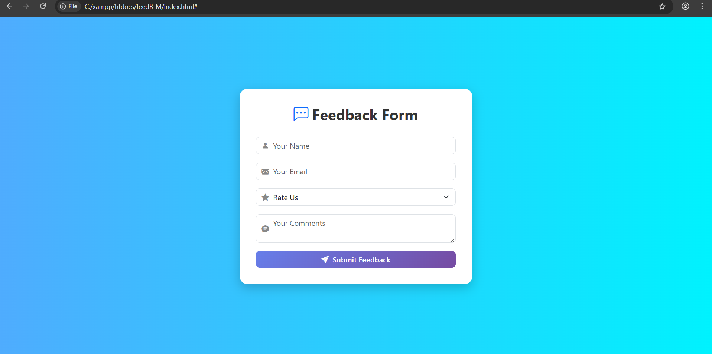

# 🌟 Feedback Form Web App

This project is a clean, modern, and responsive **Feedback Form** built with **HTML**, **Bootstrap 5**, **Bootstrap Icons**, and custom **CSS animations**.

---

## 🎯 Features

- 🎨 **Modern design** with a unique blue gradient background.
- ✅ Responsive layout using **Bootstrap 5**.
- ✨ Smooth fade-in animation on form load.
- 💬 Includes input fields for:
  - Name
  - Email
  - Rating (1–5)
  - Comments
- 🧩 Embedded **Bootstrap Icons** for better UX.
- 🎯 Custom-styled submit button with hover effects.

---

## 🚀 Technologies Used

- **HTML5**
- **CSS3**
- **Bootstrap 5**
- **Bootstrap Icons**
- (Optional for backend) Python + Flask

---

## 📸 Preview

---

## 📁 File Structure

